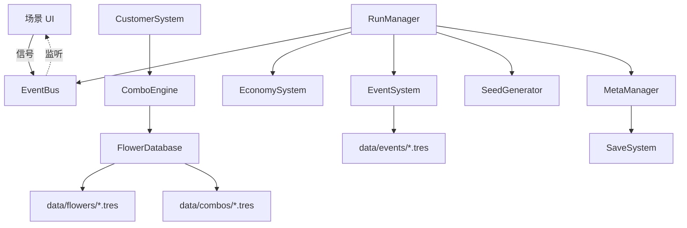

# 技术架构（v0.2）

**项目**：花间工坊（Petal Workshop）
**引擎**：Godot 4.7.2（GDScript，GL Compatibility 渲染管线，2D）

---

## 1. 技术栈与版本锁定

| 组件 | 版本 | 说明 |
|------|------|------|
| Godot | **4.7.2** stable（ed1daf0bf） | 本机：C:\Users\17801\AppData\Local\Programs\Godot\ |
| 脚本语言 | GDScript（主）/ C#（备选） | C# 仅用于未来性能敏感模块 |
| 渲染管线 | GL Compatibility | 2D 游戏，兼容面最广 |
| Steam | GodotSteam 4.22 / 4.11 | 官方确认兼容 Godot 4.7.2（见 §12），M4 引入 |
| 版本控制 | Git | 仓库根目录即本项目；Godot 4.4+ 的 *.gd.uid 文件需入库以保证资源引用稳定，协作者需统一引擎版本避免 UID 冲突 |

## 2. 架构原则（MEDS）

- **模块化（Modular）**：每个系统一个类，职责单一，可独立测试替换。
- **可编辑（Editable）**：花材 / 规则 / 事件全部 .tres 数据化，编辑器可视化配置。
- **可调试（Debuggable）**：种子可复现；冒烟测试兜底；关键路径打日志。
- **可扩展（Scalable）**：新规则 = 新 .tres，不改引擎代码。

核心原则：**数据与逻辑分离**；系统间不硬引用，统一走 EventBus 信号。

## 3. 状态分层（Roguelite 架构核心）

```
┌─────────────────────────────────────────────┐
│              META STATE（跨局持久化）         │
│  解锁 / 图鉴 / 技能点 / 声望                  │
│  存储：user://meta_save.json                 │
├─────────────────────────────────────────────┤
│              RUN STATE（单局临时）            │
│  资金 / 库存 / 天数 / 种子 / 当前阶段          │
│  每局开始重建，结束即丢弃或折算写入 Meta        │
└─────────────────────────────────────────────┘
```

**铁律**：Run State 永远不直接写 Meta State，只能通过 MetaManager 的结算接口折算。

## 4. 系统模块

### 4.1 Autoload（加载顺序即依赖顺序）

| 顺序 | Autoload | 职责 |
|------|----------|------|
| 1 | EventBus | 全局信号总线（无业务逻辑） |
| 2 | SaveSystem | JSON 存档读写（Meta / Run 分离） |
| 3 | MetaManager | 元进度状态与结算折算 |
| 4 | RunManager | 单局生命周期、每日状态机、胜负判定 |

### 4.2 核心系统类（scripts/core/）

| 类 | 类型 | 职责 |
|----|------|------|
| FlowerData | Resource | 花材数据模型 |
| ComboRule | Resource | 组合规则数据模型 + matches() 匹配 |
| ComboContext | RefCounted | 计算上下文（位置、流行、天数） |
| ComboResult | RefCounted | 计算结果（基础值、倍率、修正列表） |
| ComboEngine | RefCounted | 规则引擎：筛选 -> 排序 -> 叠加 -> 产出结果 |
| FlowerDatabase | static class | .tres 注册表（懒加载 + 缓存） |
| EconomySystem | RefCounted | 资金流转（spend / earn / 日结算） |
| DailyEvent | Resource | 每日事件模板 |
| EventSystem | RefCounted | 事件抽取（ShuffleBag 加权）、趋势聚合 |
| CustomerProfile | Resource | 顾客类型定义 |
| CustomerSystem | RefCounted | 顾客生成与花束评分 |
| SeedGenerator | RefCounted | 种子初始化、派生随机（局部 RNG） |
| ShuffleBag | RefCounted | 洗牌袋：加权公平随机 |
| DayPhase | enum | BUY / ARRANGE / DISPLAY / BUSINESS / SETTLEMENT |

### 4.3 依赖关系



## 5. 核心数据流（每日循环）

```
买花：UI 选花 -> EconomySystem.spend(成本) -> 库存 +1
组合：库存花材 -> ComboEngine.calculate_value(ids, context)
      -> ComboResult(基础值/倍率/修正) -> EventBus.combo_calculated -> UI 预览
展示：花束 -> 展示柜槽位（槽位类型写入 ComboContext）
营业：CustomerSystem 生成顾客 -> 按偏好对花束评分 -> 成交 -> EconomySystem.earn
结算：EconomySystem.end_day() -> 判定胜负 -> RunManager 推进 / 结束
      -> 结束时 MetaManager.record_run_end() 折算元进度
```

## 6. 数据资源格式（.tres 示例）

```text
[gd_resource type="Resource" script_class="FlowerData" load_steps=2 format=3]

[ext_resource type="Script" path="res://scripts/core/flower_data.gd" id="1_flower"]

[resource]
script = ExtResource("1_flower")
id = "rose"
display_name = "玫瑰"
description = "爱与热情。经典的花店主角。"
base_value = 20
cost = 10
color_tags = Array[String](["red", "warm"])
category = "rose"
rarity = 1
unlock_condition = "always"
```

新增花材 = 新增一个 .tres 文件，FlowerDatabase 启动时自动扫描注册，**零代码改动**。

## 7. 种子与随机

- 禁用全局 randi()；所有关键随机必须走局部 RandomNumberGenerator 实例（SeedGenerator 持有）。
- 加权抽取用 ShuffleBag，避免 pick_random 的统计不公平连续。
- 同种子 -> 同花材池 / 同事件序列 / 同顾客流（可复现、可分享）。

## 8. 存档格式

```json
// user://meta_save.json（M0 骨架默认值）
{
  "version": 1,
  "encyclopedia": {},
  "unlocked_flowers": [],
  "skill_points": 0,
  "upgrades": {},
  "reputation": 0,
  "runs_completed": 0,
  "best_day": 0
}
```

- Meta 存档持久化；Run 存档仅调试用，正式版删除。
- 存档损坏时降级为默认值（load_json 解析失败返回默认字典）。

## 9. 事件总线规范

- EventBus 只定义信号，不写业务逻辑。
- 发射方不知道监听方（UI / 系统皆可监听），系统间零硬引用。
- 现有信号：run_started / run_ended / day_started / day_ended / phase_changed / combo_calculated / customer_served / meta_unlocked / money_changed / day_event_rolled

## 10. 编码规范

1. **类型注解**：公开接口全部注解（Array[String]、-> ComboResult），局部变量用 := 推断。
2. **命名**：类 PascalCase；函数/变量 snake_case；常量 UPPER_SNAKE；私有成员前缀 _。
3. **注释**：每个类首行 ## 说明职责；复杂逻辑分段注释。
4. **数据优先**：可配置数值一律放 .tres，禁止硬编码进脚本（路径 / 目录常量除外）。
5. **信号优先**：跨系统通信用 EventBus；同场景父子通信用引擎信号。

## 11. 测试策略

| 层级 | 工具 | 覆盖 |
|------|------|------|
| 冒烟测试 | tests/smoke_test.tscn（--headless 运行） | 数据加载、组合计算、种子确定性、经济流转；**每次提交前必跑** |
| 单元测试 | GUT 框架（M1 引入，待评估） | ComboEngine 规则矩阵、SaveSystem 往返 |
| 平衡验证 | tests/simulate.tscn（--headless 运行） | 三种 bot 策略（贪心 / 锁定传说组合 / 保守囤金）分组统计胜率 / 破产率 / 资金分布，规模经 SIM_RUNS / SIM_DAYS 环境变量配置 |

冒烟测试运行方式见 README「快速开始」。

## 12. Steam 集成（M4）

- 插件：GodotSteam GDExtension 4.22（GDScript 侧）/ 4.11（C# 侧），官方博客确认兼容 **Godot 4.7.2**：https://godotsteam.com/blog/2026/08/22/godot-472-and-godotsteam-422--411/
- 优先级：成就 P0 -> 云存档 P0 -> 排行榜 P1 -> 统计 P1 -> Rich Presence P2。

**降级预案**（若 M4 时 GodotSteam 与引擎版本出现 ABI 兼容问题）：
1. 回退到 GodotSteam 官方验证的引擎补丁版本（当前锁定 4.7.2）；
2. 或暂缓 GDExtension，先以 Steamworks SDK 命令行（SteamCMD）完成上架发布，成就 / 云存档后补；
3. 极端情况：首版以无 Steam 特性的 DRM-Free 构建上架，再迭代接入。
- 尽早创建 Steamworks App ID；开发阶段即放入 steam_appid.txt。
- steam/ 目录 M4 引入插件后启用（当前仅占位说明）。
